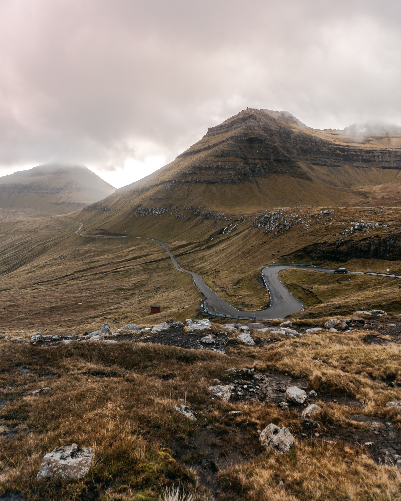

---
# Feel free to add content and custom Front Matter to this file.
# To modify the layout, see https://jekyllrb.com/docs/themes/#overriding-theme-defaults

layout: default
title: Home
permalink: /
---

  
    
        

            {{ post.date | date: "%B %-d, %Y"  }}  
            <a class="text" href="{{ post.url }}">{{ post.title }}  </a>
             
        

    

<!--    
Photo by <a href="https://unsplash.com/@p_kuzovkova?utm_source=unsplash&amp;utm_medium=referral&amp;utm_content=creditCopyText">Polina Kuzovkova</a> on <a href="https://unsplash.com/t/nature?utm_source=unsplash&amp;utm_medium=referral&amp;utm_content=creditCopyText">Unsplash</a>-->

